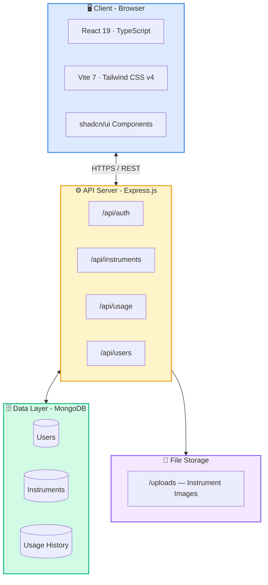
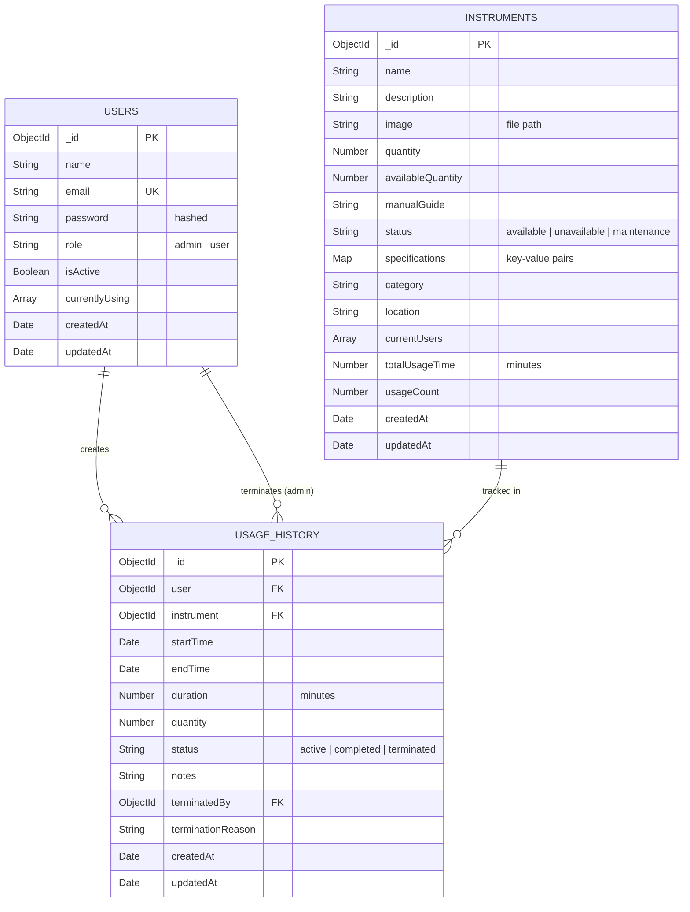
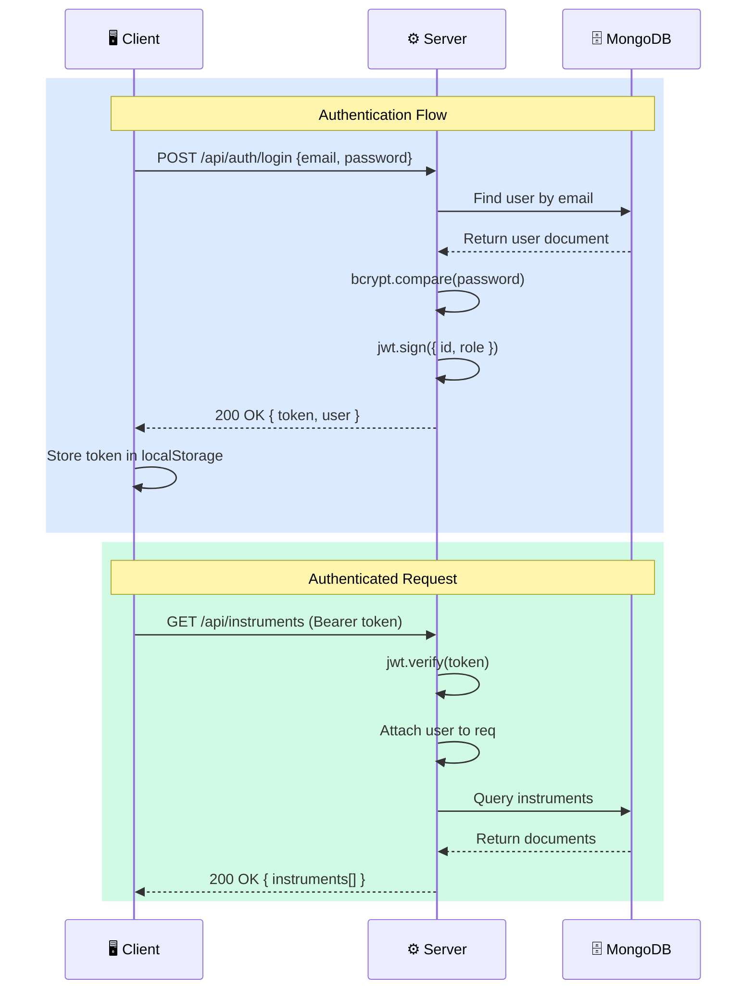

<div align="center">

# 🧪 Laboratory Management System

### Modern, full-stack platform for managing laboratory instruments, tracking real-time usage, and streamlining lab operations.

[](https://nodejs.org/)
[](https://react.dev/)
[](https://www.typescriptlang.org/)
[](https://www.mongodb.com/)
[](https://vitejs.dev/)
[](https://tailwindcss.com/)
[](https://opensource.org/licenses/ISC)

---

**[Live Demo](https://laboratory-management-app.vercel.app)** · **[API Docs](./docs/API_DOCUMENTATION.md)** · **[Report Bug](../../issues/new?template=bug_report.md)** · **[Request Feature](../../issues/new?template=feature_request.md)**

</div>

---

## 📖 Table of Contents

- [Overview](#-overview)
- [Key Features](#-key-features)
- [Architecture](#-architecture)
- [Tech Stack](#-tech-stack)
- [Getting Started](#-getting-started)
- [Environment Variables](#-environment-variables)
- [API Reference](#-api-reference)
- [Database Schema](#-database-schema)
- [Authentication & Authorization](#-authentication--authorization)
- [Security](#-security)
- [Deployment](#-deployment)
- [Project Structure](#-project-structure)
- [Usage Statistics & Analytics](#-usage-statistics--analytics)
- [Contributing](#-contributing)
- [Roadmap](#-roadmap)
- [License](#-license)
- [Acknowledgements](#-acknowledgements)

---

## 🔭 Overview

The **Laboratory Management System** is a comprehensive, production-ready web application designed for educational and research institutions to efficiently manage laboratory instruments, monitor real-time usage, and maintain complete audit trails. Built on the **MERN stack** (MongoDB, Express.js, React, Node.js), it provides separate interfaces for administrators and regular users with role-based access control.

### Problem Statement

Research and educational laboratories often struggle with:
- **Instrument availability conflicts** — multiple users attempting to use the same equipment
- **Untracked usage** — no records of who used what, when, and for how long
- **Manual management overhead** — paper logs and spreadsheets that are error-prone
- **Lack of accountability** — no way to enforce usage policies or monitor compliance

### Solution

This platform digitizes the entire laboratory instrument lifecycle — from cataloging and availability tracking to real-time session monitoring and historical analytics — with a modern, intuitive interface and robust API backend.

---

## ✨ Key Features

<table>
<tr>
<td width="50%">

### 👤 User Portal
- 🔍 **Instrument Discovery** — Browse, search, and filter instruments by category, status, and availability
- ⏱️ **Real-Time Usage Tracking** — Start/stop sessions with automatic time tracking and live timers
- 📊 **Personal Dashboard** — View usage history, active sessions, and personal statistics
- 📋 **Instrument Details** — Access specifications, manuals, location info, and guidelines
- 👤 **Profile Management** — Track personal usage stats, session history, and account details

</td>
<td width="50%">

### 🛡️ Admin Portal
- 🧪 **Instrument CRUD** — Create, update, delete instruments with image uploads and specifications
- 👥 **User Management** — Control access, activate/deactivate users, assign roles
- 📈 **Analytics Dashboard** — Comprehensive statistics across all instruments and users
- ⛔ **Force Stop Sessions** — Terminate active user sessions with reason logging
- 🏷️ **Category Management** — Organize instruments into logical categories
- 📜 **Complete Audit Trail** — Full usage history with filtering, search, and export

</td>
</tr>
</table>

---

## 🏗️ Architecture



### Request Lifecycle

```mermaid
graph LR
    A["🌐 Client Request"] --> B["🛡️ Helmet\n(Security Headers)"]
    B --> C["⏱️ Rate Limiter\n(Throttle)"]
    C --> D["🔗 CORS Check\n(Origin Validation)"]
    D --> E["📍 Router\n(Dispatch)"]
    E --> F["🔑 JWT Auth\nMiddleware"]
    F --> G["✅ Request\nValidator"]
    G --> H["📦 Route\nHandler"]
    H --> I["🔄 Mongoose\nODM"]
    I --> J[("🗄️ MongoDB")]

    style A fill:#dbeafe,stroke:#3b82f6,stroke-width:2px
    style B fill:#fecaca,stroke:#ef4444,stroke-width:2px
    style C fill:#fed7aa,stroke:#f97316,stroke-width:2px
    style D fill:#fef3c7,stroke:#f59e0b,stroke-width:2px
    style E fill:#d1fae5,stroke:#10b981,stroke-width:2px
    style F fill:#e0e7ff,stroke:#6366f1,stroke-width:2px
    style G fill:#f3e8ff,stroke:#8b5cf6,stroke-width:2px
    style H fill:#dbeafe,stroke:#3b82f6,stroke-width:2px
    style I fill:#d1fae5,stroke:#10b981,stroke-width:2px
    style J fill:#d1fae5,stroke:#10b981,stroke-width:2px
```



---

## 🛠️ Tech Stack

### Backend

| Technology | Version | Purpose |
|:---|:---|:---|
| **Node.js** | 18+ | JavaScript runtime |
| **Express.js** | 4.18 | Web framework |
| **MongoDB** | 7+ | NoSQL database |
| **Mongoose** | 8.x | MongoDB object modeling (ODM) |
| **JWT** | 9.x | Stateless authentication tokens |
| **bcryptjs** | 2.4 | Password hashing (12 salt rounds) |
| **Helmet** | 7.x | HTTP security headers |
| **express-rate-limit** | 7.x | API rate limiting |
| **express-validator** | 7.x | Input validation & sanitization |
| **Multer** | 1.4 | Multipart form / file uploads |
| **dotenv** | 16.x | Environment variable management |
| **nodemon** | 3.x | Development hot-reload |

### Frontend

| Technology | Version | Purpose |
|:---|:---|:---|
| **React** | 19 | UI library |
| **TypeScript** | 5.8 | Type-safe JavaScript |
| **Vite** | 7.x | Next-gen build tool & dev server |
| **Tailwind CSS** | 4.x | Utility-first CSS framework |
| **shadcn/ui** | latest | Accessible UI component library (Radix UI) |
| **React Router** | 7.x | Client-side routing |
| **Axios** | 1.x | HTTP client with interceptors |
| **React Hook Form** | 7.x | Performant form management |
| **Zod** | 4.x | Schema validation |
| **Lucide React** | 0.534 | Icon library |
| **Sonner** | 2.x | Toast notification system |
| **date-fns** | 4.x | Date utility library |
| **next-themes** | 0.4 | Theme management (dark/light mode) |

---

## 🚀 Getting Started

### Prerequisites

Ensure you have the following installed:

| Requirement | Minimum Version | Check Command |
|:---|:---|:---|
| **Node.js** | v18.0.0 | `node --version` |
| **npm** | v9.0.0 | `npm --version` |
| **MongoDB** | v7.0 (local) or Atlas | `mongosh --version` |
| **Git** | v2.30+ | `git --version` |

### Installation

**1. Clone the repository**

```bash
git clone https://github.com/Deepak1230987/Laboratory-Management-App.git
cd Laboratory-Management-App
```

**2. Install backend dependencies**

```bash
cd backend
npm install
```

**3. Install frontend dependencies**

```bash
cd ../client
npm install
```

**4. Configure environment variables**

Create `.env` files in both `backend/` and `client/` directories (see [Environment Variables](#-environment-variables) below).

**5. Start the development servers**

```bash
# Terminal 1 — Backend (from /backend)
npm run dev

# Terminal 2 — Frontend (from /client)
npm run dev
```

**6. Access the application**

| Service | URL |
|:---|:---|
| Frontend | [http://localhost:5173](http://localhost:5173) |
| Backend API | [http://localhost:5000/api](http://localhost:5000/api) |
| Health Check | [http://localhost:5000/api/health](http://localhost:5000/api/health) |

---

## 🔐 Environment Variables

### Backend (`backend/.env`)

```env
# Server
PORT=5000
NODE_ENV=development

# Database
MONGODB_URI=mongodb+srv://<username>:<password>@cluster.mongodb.net/lab-management?retryWrites=true&w=majority

# Authentication
JWT_SECRET=your-super-secret-jwt-key-min-32-chars
JWT_EXPIRES_IN=7d

# CORS
CORS_ALLOWED_ORIGINS=http://localhost:5173,http://localhost:3000
```

### Frontend (`client/.env`)

```env
VITE_API_URL=http://localhost:5000/api
NODE_ENV=development
```

> [!WARNING]
> **Never commit `.env` files to version control.** The `.gitignore` is pre-configured to exclude them. Always use strong, unique values for `JWT_SECRET` in production (minimum 32 characters).

---

## 📡 API Reference

All endpoints are prefixed with `/api`. Protected routes require a valid JWT token in the `Authorization: Bearer <token>` header.

> For complete request/response schemas, see **[API Documentation →](./docs/API_DOCUMENTATION.md)**

### Authentication

| Method | Endpoint | Access | Description |
|:---|:---|:---|:---|
| `POST` | `/auth/register` | Public | Register a new user account |
| `POST` | `/auth/login` | Public | Authenticate and receive JWT token |
| `GET` | `/auth/verify` | Protected | Verify token validity |

### Instruments

| Method | Endpoint | Access | Description |
|:---|:---|:---|:---|
| `GET` | `/instruments` | Protected | List instruments (search, filter, paginate) |
| `GET` | `/instruments/:id` | Protected | Get instrument details |
| `POST` | `/instruments` | Admin | Create a new instrument |
| `PUT` | `/instruments/:id` | Admin | Update instrument details |
| `DELETE` | `/instruments/:id` | Admin | Delete an instrument |

### Usage Sessions

| Method | Endpoint | Access | Description |
|:---|:---|:---|:---|
| `POST` | `/usage/start` | Protected | Start an instrument session |
| `POST` | `/usage/stop` | Protected | Stop an active session |
| `POST` | `/usage/force-stop` | Admin | Force terminate a session |
| `GET` | `/usage/history/me` | Protected | Get personal usage history |
| `GET` | `/usage/history/all` | Admin | Get all usage records |

### Users

| Method | Endpoint | Access | Description |
|:---|:---|:---|:---|
| `GET` | `/users/profile` | Protected | Get current user profile |
| `GET` | `/users/all` | Admin | List all users |
| `PATCH` | `/users/:id/status` | Admin | Activate/deactivate a user |
| `PATCH` | `/users/:id/role` | Admin | Change user role |

### System

| Method | Endpoint | Access | Description |
|:---|:---|:---|:---|
| `GET` | `/health` | Public | Health check with timestamp |

---

## 🗄️ Database Schema

### Entity Relationship



### User Model

```javascript
{
  name:           String,             // Full name
  email:          String (unique),    // Login identifier
  password:       String (hashed),    // bcrypt with 12 salt rounds
  role:           'admin' | 'user',   // Role-based access
  isActive:       Boolean,            // Account status (admin-controlled)
  currentlyUsing: [{                  // Active instrument sessions
    instrument:   ObjectId → Instrument,
    startTime:    Date
  }],
  timestamps:     true                // createdAt, updatedAt
}
```

### Instrument Model

```javascript
{
  name:              String,                    // Instrument name
  description:       String,                    // Detailed description
  image:             String,                    // Upload file path
  quantity:          Number,                    // Total units
  availableQuantity: Number,                    // Currently available units
  manualGuide:       String,                    // Usage instructions
  status:            'available' | 'unavailable' | 'maintenance',
  specifications:    Map<String, String>,       // Dynamic key-value specs
  category:          String,                    // Instrument category
  location:          String,                    // Physical location
  currentUsers:      [{                         // Active sessions
    user:            ObjectId → User,
    startTime:       Date,
    quantity:        Number
  }],
  totalUsageTime:    Number,                    // Cumulative minutes
  usageCount:        Number,                    // Total session count
  timestamps:        true
}
```

### UsageHistory Model

```javascript
{
  user:              ObjectId → User,           // Session user
  instrument:        ObjectId → Instrument,     // Session instrument
  startTime:         Date,                      // Session start
  endTime:           Date,                      // Session end
  duration:          Number,                    // Duration in minutes
  quantity:          Number,                    // Units used
  status:            'active' | 'completed' | 'terminated',
  notes:             String,                    // Optional notes
  terminatedBy:      ObjectId → User,           // Admin who force-stopped
  terminationReason: String,                    // Reason for termination
  timestamps:        true
}
```

---

## 🔒 Authentication & Authorization

### JWT Token Flow



### Role-Based Access Control

| Capability | User | Admin |
|:---|:---:|:---:|
| Browse instruments | ✅ | ✅ |
| Start/stop usage sessions | ✅ | ✅ |
| View personal usage history | ✅ | ✅ |
| Update own profile | ✅ | ✅ |
| Create/edit/delete instruments | ❌ | ✅ |
| View all users | ❌ | ✅ |
| Activate/deactivate users | ❌ | ✅ |
| Change user roles | ❌ | ✅ |
| Force-stop any session | ❌ | ✅ |
| View all usage history | ❌ | ✅ |
| Access analytics dashboard | ❌ | ✅ |

---

## 🛡️ Security

The application implements multiple layers of security hardening:

| Layer | Implementation | Details |
|:---|:---|:---|
| **Password Hashing** | bcryptjs | 12 salt rounds; passwords never returned in API responses |
| **Authentication** | JSON Web Tokens | Configurable expiration (`JWT_EXPIRES_IN`); stateless validation |
| **HTTP Headers** | Helmet.js | Sets security headers (CSP, HSTS, X-Frame-Options, etc.) |
| **Rate Limiting** | express-rate-limit | 500 req/15min (prod), 1000 req/15min (dev); OPTIONS exempt |
| **CORS** | Configurable origins | Whitelist-based origin validation; credentials support |
| **Input Validation** | express-validator | Server-side validation on all endpoints; XSS sanitization |
| **Schema Validation** | Zod (client) | Client-side form validation with type-safe schemas |
| **File Uploads** | Multer | Image-only MIME type filtering; 5MB size limit; sanitized filenames |
| **Error Handling** | Custom middleware | Stack traces hidden in production; structured error responses |

---

## 🚢 Deployment

### Recommended Production Stack

| Component | Service | Cost |
|:---|:---|:---|
| Frontend | **Vercel** | Free tier available |
| Backend | **Render** | Free tier available |
| Database | **MongoDB Atlas** | Free tier (512MB) |

---

### Backend → Render

1. Create a **Web Service** on [Render](https://render.com)
2. Connect your GitHub repository
3. Configure the service:

   | Setting | Value |
   |:---|:---|
   | **Root Directory** | `backend` |
   | **Build Command** | `npm install` |
   | **Start Command** | `npm start` |

4. Add environment variables:

   ```env
   PORT=5000
   MONGODB_URI=<your-mongodb-atlas-uri>
   JWT_SECRET=<strong-random-secret-min-32-chars>
   JWT_EXPIRES_IN=7d
   NODE_ENV=production
   CORS_ALLOWED_ORIGINS=https://your-frontend-domain.vercel.app
   ```

---

### Frontend → Vercel

1. Install the Vercel CLI:
   ```bash
   npm i -g vercel
   ```

2. Create `client/.env.production`:
   ```env
   VITE_API_URL=https://your-backend.onrender.com/api
   NODE_ENV=production
   ```

3. Deploy:
   ```bash
   cd client
   vercel --prod
   ```

4. Set environment variables in the [Vercel Dashboard](https://vercel.com/dashboard).

---

### MongoDB Atlas

1. Create a free cluster at **[cloud.mongodb.com](https://cloud.mongodb.com)**
2. Create a database user with read/write privileges
3. Whitelist IP addresses:
   - `0.0.0.0/0` for cloud services (Render/Vercel)
   - Or specific IPs for tighter security
4. Copy the connection string → update `MONGODB_URI`

---

## 📁 Project Structure

```
Laboratory-Management-App/
│
├── 📂 backend/                      # Express.js API server
│   ├── 📂 middleware/
│   │   ├── auth.js                  # JWT verification & role-checking middleware
│   │   └── upload.js                # Multer config (image uploads, 5MB limit)
│   ├── 📂 models/
│   │   ├── User.js                  # User schema (bcrypt hooks, role enum)
│   │   ├── Instrument.js            # Instrument schema (specs map, usage tracking)
│   │   └── UsageHistory.js          # Session records (start/end, duration, status)
│   ├── 📂 routes/
│   │   ├── auth.js                  # POST /register, /login, GET /verify
│   │   ├── instruments.js           # Full CRUD with search, filter, pagination
│   │   ├── usage.js                 # Start/stop/force-stop sessions, history
│   │   └── users.js                 # Profile, list all, status/role management
│   ├── 📂 uploads/                  # Instrument image storage (gitignored)
│   ├── server.js                    # App entry — middleware, DB, routes, error handling
│   ├── package.json
│   └── .env                         # Environment config (gitignored)
│
├── 📂 client/                       # React + TypeScript frontend
│   ├── 📂 public/                   # Static assets
│   ├── 📂 src/
│   │   ├── 📂 components/
│   │   │   ├── 📂 ui/              # 14 shadcn/ui components (Button, Card, Dialog,
│   │   │   │                        #   Table, Tabs, Select, Input, Badge, etc.)
│   │   │   ├── Header.tsx           # App header with user menu & navigation
│   │   │   ├── Sidebar.tsx          # Role-aware navigation sidebar
│   │   │   ├── Layout.tsx           # Authenticated layout wrapper
│   │   │   └── LoadingSpinner.tsx   # Loading state component
│   │   ├── 📂 contexts/
│   │   │   ├── AuthContext.ts       # Auth context type definitions
│   │   │   └── AuthContext.tsx      # Auth provider (login, logout, token mgmt)
│   │   ├── 📂 hooks/
│   │   │   └── useAuth.ts          # Custom hook for auth context consumption
│   │   ├── 📂 lib/
│   │   │   ├── api.ts              # Axios instance with auth interceptors
│   │   │   ├── auth.ts             # Auth API calls (login, register, verify)
│   │   │   ├── instruments.ts      # Instrument CRUD API calls
│   │   │   ├── usage.ts            # Usage session API calls
│   │   │   ├── users.ts            # User management API calls
│   │   │   └── utils.ts            # Utility functions (cn helper)
│   │   ├── 📂 pages/
│   │   │   ├── LandingPage.tsx     # Public landing page with hero & features
│   │   │   ├── 📂 auth/
│   │   │   │   ├── LoginPage.tsx    # Login form with validation
│   │   │   │   └── RegisterPage.tsx # Registration form with validation
│   │   │   ├── 📂 user/
│   │   │   │   ├── Dashboard.tsx    # User dashboard with statistics
│   │   │   │   ├── InstrumentList.tsx   # Browse & search instruments
│   │   │   │   ├── InstrumentDetail.tsx # Detailed view with usage controls
│   │   │   │   └── Profile.tsx      # User profile & session history
│   │   │   └── 📂 admin/
│   │   │       ├── Dashboard.tsx    # Admin analytics dashboard
│   │   │       ├── Instruments.tsx  # Instrument CRUD management
│   │   │       ├── Users.tsx        # User management table
│   │   │       └── UsageHistory.tsx # Complete usage audit log
│   │   ├── 📂 types/
│   │   │   └── index.ts            # Shared TypeScript interfaces
│   │   ├── App.tsx                  # Route definitions & auth guards
│   │   ├── main.tsx                 # Application entry point
│   │   └── index.css                # Tailwind CSS configuration
│   ├── vite.config.ts               # Vite build configuration
│   ├── tsconfig.json                # TypeScript configuration
│   ├── components.json              # shadcn/ui configuration
│   └── package.json
│
├── 📂 docs/                         # Project documentation
│   ├── INDEX.md                     # Documentation index
│   ├── API_DOCUMENTATION.md         # Complete API reference
│   ├── FRONTEND_DOCUMENTATION.md    # Frontend architecture guide
│   ├── DEVELOPMENT_GUIDE.md         # Developer onboarding guide
│   ├── DEPLOYMENT_GUIDE.md          # Production deployment guide
│   └── QUICK_REFERENCE.md           # Quick reference card
│
└── README.md                        # ← You are here
```

---

## 📊 Usage Statistics & Analytics

The system captures and aggregates the following metrics:

| Metric | Scope | Description |
|:---|:---|:---|
| **Total Usage Time** | Per instrument | Cumulative time across all sessions |
| **Total Usage Time** | Per user | Aggregated across all instruments used |
| **Session Count** | Per instrument | Number of completed sessions |
| **Average Duration** | Per instrument | Mean session length |
| **Active Sessions** | System-wide | Currently running instrument sessions |
| **User Activity** | Per user | Login frequency, session patterns |
| **Instrument Utilization** | Per instrument | Available vs. in-use ratio |

---

## 🤝 Contributing

Contributions are welcome! Please follow these steps:

1. **Fork** the repository
2. **Create** a feature branch:
   ```bash
   git checkout -b feature/your-feature-name
   ```
3. **Commit** your changes with [Conventional Commits](https://www.conventionalcommits.org/):
   ```bash
   git commit -m "feat: add instrument booking calendar"
   ```
4. **Push** to your branch:
   ```bash
   git push origin feature/your-feature-name
   ```
5. **Open** a Pull Request with a clear description of changes

### Development Guidelines

- Follow the existing code style and ESLint configuration
- Write TypeScript with proper type annotations (no `any`)
- Keep components small, focused, and reusable
- Add input validation on both client and server
- Update documentation for any API changes

---

## 🗺️ Roadmap

- [ ] 📧 Email notifications for usage reminders and session alerts
- [ ] 🔧 Instrument maintenance scheduling and tracking
- [ ] 📊 Advanced analytics with charts and exportable reports
- [ ] 📱 Mobile application (React Native)
- [ ] 📷 QR code scanning for quick instrument identification
- [ ] 📅 Calendar integration for instrument booking
- [ ] 📄 Automated usage report generation (PDF)
- [ ] 🌍 Multi-language support (i18n)
- [ ] 🔔 Real-time push notifications (WebSocket/SSE)
- [ ] 🧑‍🔬 Department-based instrument access control

---

## 📝 License

This project is licensed under the **ISC License** — see the [LICENSE](LICENSE) file for details.

---

## 🙏 Acknowledgements

- [React](https://react.dev/) — UI library
- [shadcn/ui](https://ui.shadcn.com/) — Beautiful, accessible components
- [Tailwind CSS](https://tailwindcss.com/) — Utility-first CSS
- [Express.js](https://expressjs.com/) — Web framework for Node.js
- [MongoDB](https://www.mongodb.com/) — Document database
- [Vite](https://vitejs.dev/) — Next-generation build tool
- [Lucide](https://lucide.dev/) — Beautiful open-source icons

---

## 📚 Additional Documentation

| Document | Description |
|:---|:---|
| **[API Documentation](./docs/API_DOCUMENTATION.md)** | Complete REST API reference with request/response examples |
| **[Frontend Architecture](./docs/FRONTEND_DOCUMENTATION.md)** | Component hierarchy, state management, and routing |
| **[Development Guide](./docs/DEVELOPMENT_GUIDE.md)** | Developer onboarding, coding standards, and workflows |
| **[Deployment Guide](./docs/DEPLOYMENT_GUIDE.md)** | Step-by-step production deployment instructions |
| **[Quick Reference](./docs/QUICK_REFERENCE.md)** | Cheat sheet for common commands and endpoints |

---

<div align="center">

**Built with ❤️ for modern laboratories**

[⬆ Back to Top](#-laboratory-management-system)

</div>
